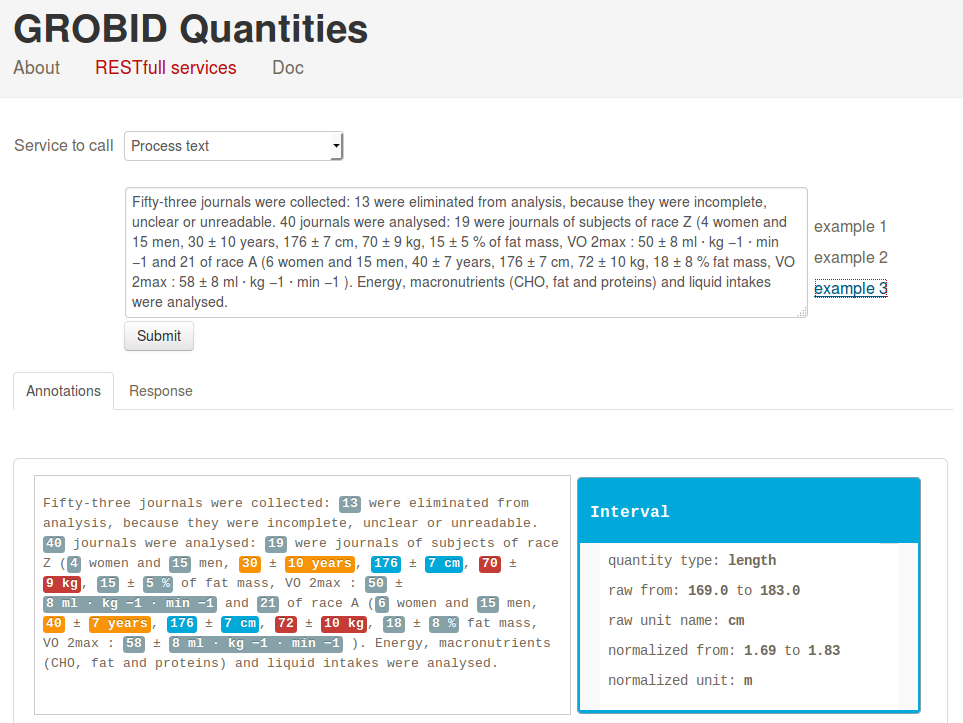

# grobid-quantities

[](http://www.apache.org/licenses/LICENSE-2.0.html)
<!-- [](https://travis-ci.org/kermitt2/grobid-quantities) -->
<!-- [](https://coveralls.io/r/kermitt2/grobid-quantities) -->
<!-- [](https://readthedocs.org/projects/grobid-quantities/?badge=latest) -->

__Work in progress.__

The goal of this GROBID module is to recognize in textual documents any expressions of measurements (e.g. _pressure_, _temperature_, etc.), to parse and normalization them, and finally to convert these measurements into SI units. 



One additional goal is also to identify and attached to the measurements the "quantified" substance, e.g. _silicon nitride powder_ in 

```
A mixture of 10kg silicon nitride powder was charged into the mixing chamber 20 of the mixing vessel 18.
```

As the other GROBID models, the module relies only on machine learning and uses linear CRF. 

## Install, build, run

First install the latest development version of GROBID as explained by the [documentation](http://grobid.readthedocs.org).

Copy the module quantities as sibling sub-project to grobid-core, grobid-trainer, etc.:
> cp -r grobid-quantities grobid/

Try compiling everything with:
> cd PATH-TO-GROBID/grobid/

> mvn -Dmaven.test.skip=true clean install

Run some test: 
> cd PATH-TO-GROBID/grobid/grobid-quantities

> mvn compile test

The models have to be trained before running the tests!

## Training

For training the quantity model:
> cd PATH-TO-GROBID/grobid/grobid-quantities

> mvn generate-resources -Ptrain_quantities

For training the unit model:

> mvn generate-resources -Ptrain_units

The models will be saved under grobid-home/models/quantities and grobid-home/models/quantities respectively.

## Training data

As the rest of GROBID, the training data is encoded following the [TEI P5](http://www.tei-c.org/Guidelines/P5). See the GROBID quantities [annotation guidelines page](doc/Annotation-Guidelines.md) for detailed explanations and examples.  

## Generation of training data

Similarly as for Grobid, with executable name ```createTrainingQuantities```, for example: 

> java -jar target/grobid-quantities-0.4.0-SNAPSHOT.one-jar.jar -gH ../grobid-home/ -gP ../grobid-home/config/grobid.properties -dIn ~/grobid/grobid-quantities/src/test/resources/ -dOut ~/test/ -exe createTrainingQuantities

The input directory can contain PDF (.pdf, scientific articles only), XML/TEI (.xml or .tei, for patents and scientific articles) and text files (.txt).


## Start the service

> mvn -Dmaven.test.skip=true jetty:run-war

Demo/console web app is then accessible at ```http://localhost:8080```

Using ```curl```:

```
curl -G --data-urlencode "text=I've lost one minute." localhost:8080/processQuantityText
```
