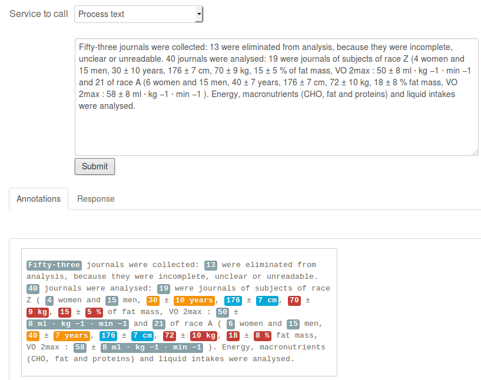
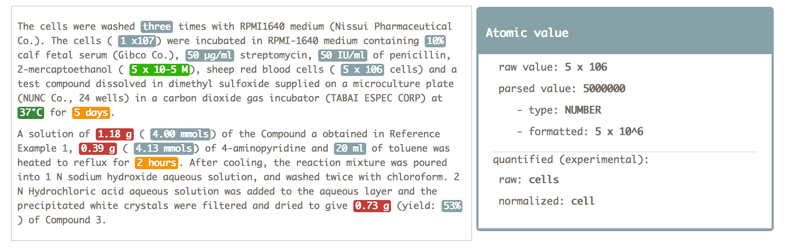
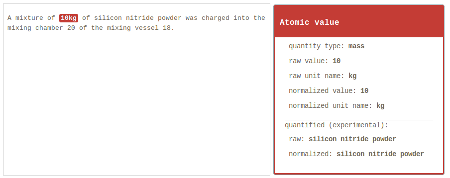

# grobid-quantities

<!--  -->
<!--  -->

__Work in progress.__

The goal of this GROBID module is to recognize in textual documents any expressions of measurements (e.g. _pressure_, _temperature_, etc.), to parse and normalization them, and finally to convert these measurements into SI units. 
We focus our work on technical and scientific articles (text, XML and PDF input) and patents (text and XML input). 

As part of this task we support the recognition of the different value representation: numerical, alphabetical, exponential and date/time expressions. 

Finally we support the identification of the "quantified" substance related to the measure, e.g. _silicon nitride powder_ in 

As the other GROBID models, the module relies only on machine learning and uses linear CRF. 
The normalisation is handled by the java library [Units of measurement](http://unitsofmeasurement.github.io/).  

## Documentation

You can find the latest documentation [here](http://grobid-quantities.readthedocs.io). 

## License

GROBID and grobid-quantities are distributed under [Apache 2.0 license](http://www.apache.org/licenses/LICENSE-2.0). 

Contact: Patrice Lopez (<patrice.lopez@science-miner.com>), Luca Foppiano (<luca.foppiano@inria.fr>)