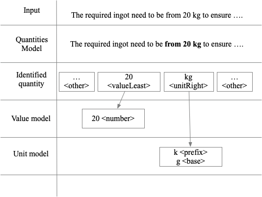
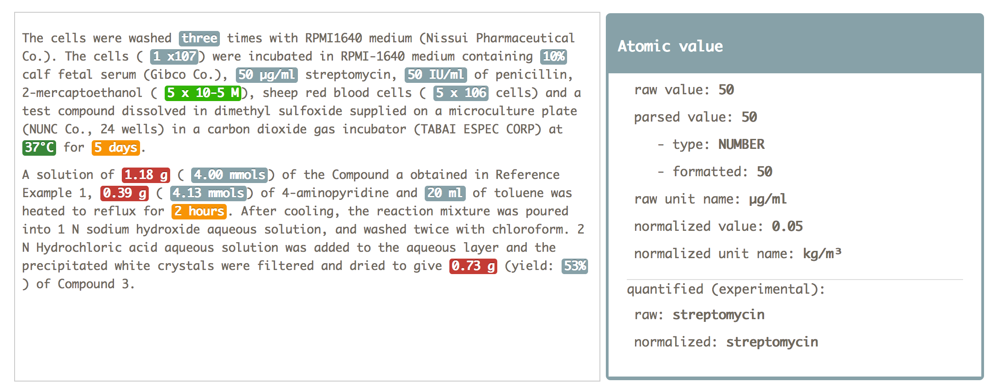

# Introduction

Grobid-quantities is a Java application, based on [Grobid](http://github.com/kermitt2/grobid) (GeneRation Of
BIbliographic Data), a machine learning framework for parsing and structuring raw documents such as PDF or plain text.
Grobid-quantities is designed for large-scale processing tasks in batch or via a web REST API.

The machine learning engine architecture follows the cascade approach, where each model is specialised in the resolution of a specific task.

**Quantities** are modelled using three different types:
1. `atomic values` in case of single measurements (e.g., 10 grams),
2. `interval` (e.g. `from 3 to 5 km`) and `range` (`100 +- 4` ) for continuous values, and,
3. `lists` of discrete values where the measurement unit is shared.

**Units** are decomposed and restructured. Complementary information like unit system, type of measurement are attached by lookup in an internal lexicon.

**Values** are parsed, supporting different representations:
1. numeric (`2`, `1000`)
1. alphabetic (`tw`, `thousand`),
1. power of 10 (`1.5 x 10^-5`)
1. date/time expressions

These three models are provided in multiple architectures. 
The integration with Grobid-quantities (derived from Grobid) is described [here](https://grobid.readthedocs.io/en/latest/Deep-Learning-models/).

**TLDR** Grobid-quantities supports Conditional Random Field (CRF), Recurrent Neural Networks (RNN) using the bidirectional LSTM + CRF (as activation layer) (BidLSTM_CRF).

The measurements that are identified are normalised toward the International System of Units (SI) using the java library [Units of measurement](http://unitsofmeasurement.github.io/).

Grobid-quantities also contains a module implementing the identification of the "quantified" object/substance related to the measure. This module is still *experimental*.

The following screenshot illustrate an example of measurement that is extracted, parsed and normalised, the quantified substance, *streptomycin* is additionally recognised:

## Contacts

Contact: Patrice Lopez (patrice.lopez_AT_science-miner.com), Luca Foppiano (luca_AT_foppiano.org)

## License

GROBID and grobid-quantities are distributed under [Apache 2.0 license](http://www.apache.org/licenses/LICENSE-2.0). The documentation is distributed under [CC-0](https://creativecommons.org/publicdomain/zero/1.0/) license. The annotated data are licenced under [CC 4.0 BY](https://creativecommons.org/licenses/by/4.0/).

If you contribute to grobid-quantities, you agree to share your contribution following these licenses.

The [references](references.md) page contains citations, acknowledgement and references resources related to the project.
